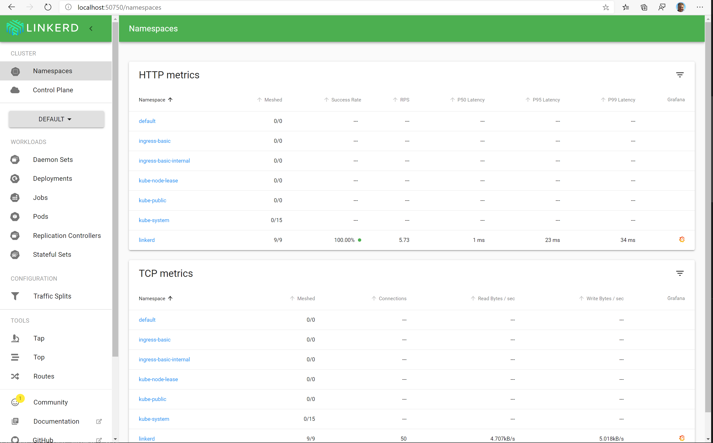
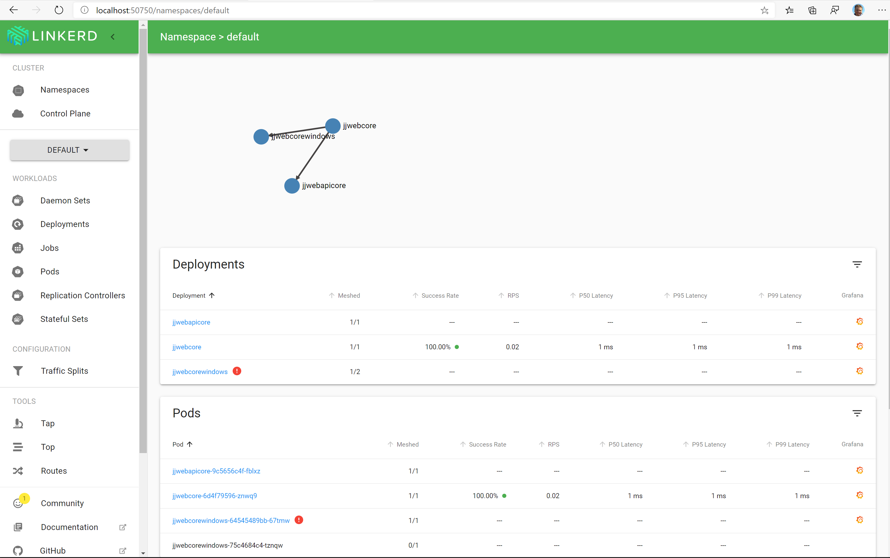
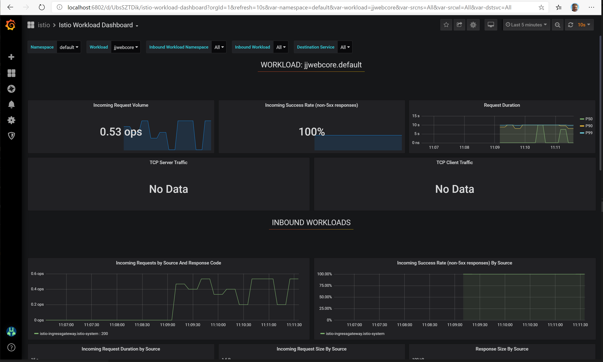
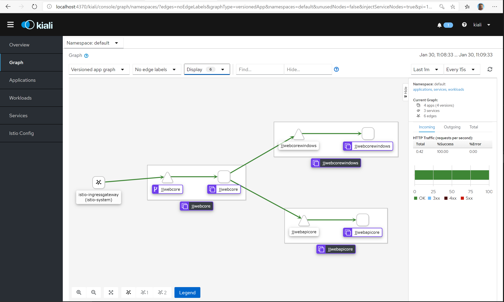

# Azure AKS and Service Meshes

Select Service Mesh you want to install

https://docs.microsoft.com/en-us/azure/aks/servicemesh-about

## Deploy Linkerd

[Linkerd](https://docs.microsoft.com/en-us/azure/aks/servicemesh-linkerd-about) is an easy to use and **lightweight service mesh**.

How to install Linkerd follow this [steps](https://docs.microsoft.com/en-us/azure/aks/servicemesh-linkerd-install?pivots=client-operating-system-linux).

### Install Linkerd library

```bash
# Specify the Linkerd version that will be leveraged throughout these instructions
LINKERD_VERSION=stable-2.6.0
curl -sLO "https://github.com/linkerd/linkerd2/releases/download/$LINKERD_VERSION/linkerd2-cli-$LINKERD_VERSION-linux"
sudo cp ./linkerd2-cli-$LINKERD_VERSION-linux /usr/local/bin/linkerd
sudo chmod +x /usr/local/bin/linkerd
```

Check Linkerd command and check installation.

```bash
linkerd check --pre
```

### Deploy Linkerd into AKS

```bash
linkerd install | kubectl apply -f -
kubectl get svc --namespace linkerd --output wide
kubectl get pod --namespace linkerd --output wide
```

And check installation and run Dashboard

```bash
linkerd check

linkerd dashboard
```



### Deploy Linkerd to my jjweb

Deploy website to AKS as described in projects.

Next inject Linkerd into deployment in Default namespace.
Is not supported on Windows nodes.

```bash
kubectl get -n default deploy -o yaml \
  | linkerd inject - \
  | kubectl apply -f -

linkerd dashboard
```



## Deploy Istio

[Istio](https://docs.microsoft.com/en-us/azure/aks/servicemesh-istio-about) is is a **full featured**, customisable, and extensible service mesh.

How to install Istio follow this [steps](https://docs.microsoft.com/en-us/azure/aks/servicemesh-istio-install?pivots=client-operating-system-linux).

### Install Istio library

```bash
# Specify the Istio version that will be leveraged throughout these instructions
ISTIO_VERSION=1.4.0
curl -sL "https://github.com/istio/istio/releases/download/$ISTIO_VERSION/istio-$ISTIO_VERSION-linux.tar.gz" | tar xz
cd istio-$ISTIO_VERSION
sudo cp ./bin/istioctl /usr/local/bin/istioctl
sudo chmod +x /usr/local/bin/istioctl
```

Check Istio command is installed.

```bash
istioctl version
```

### Deploy Istio into AKS

Scale AKS cluster to 4 nodes because of new Istio resources.

```bash
ISTIO_VERSION=1.4.0
cd istio-$ISTIO_VERSION
kubectl create namespace istio-system --save-config
istioctl manifest apply -f ../aks/istio.yaml --logtostderr --set installPackagePath=./install/kubernetes/operator/charts
```

Check installation

```bash
kubectl get svc --namespace istio-system --output wide
kubectl get pods --namespace istio-system
```

Check dashboard

```bash
istioctl dashboard grafana
istioctl dashboard prometheus
istioctl dashboard jaeger
istioctl dashboard kiali
istioctl dashboard envoy <pod-name>.<namespace>
```

### Deploy Istio to my jjweb

Deploy website to AKS as described in projects.

Next inject Istio into deployment in Default namespace.
Is supported on Windows nodes too.

```bash
kubectl label namespace default istio-injection=enabled
```

Now you have to change ingress to Istio.

```bash
kubectl apply -f aks/istio.jjwebcore.yaml
```

Generate client web requests to website and check dashboards

```bash
istioctl dashboard grafana
istioctl dashboard kiali
while true; do curl -s "http://51.136.74.4/Home/Test"; echo; sleep 0.2; done
```



