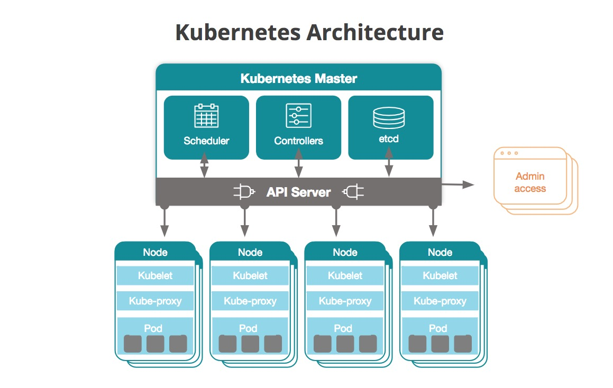
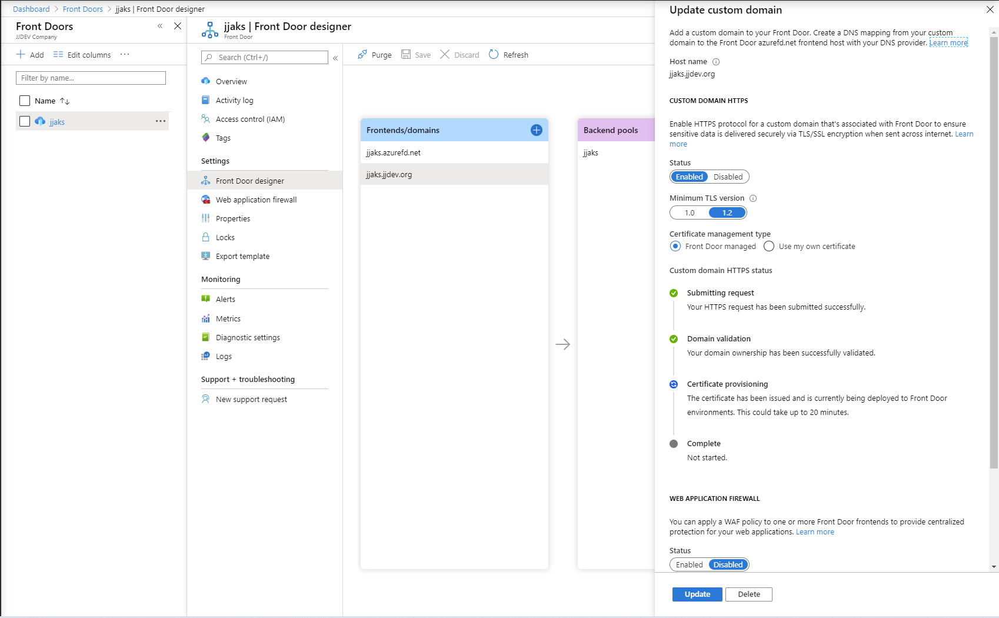
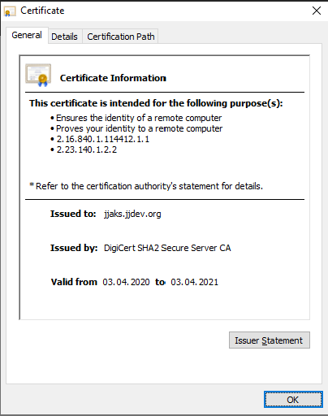

# JJ Azure .Net Core samples
Azure dotNet Core web and api running on Azure Managed Kubernetes (AKS).

## Projects

### Project WebApp dotNet Core [jjazure-web-dotnetcore](src-webui/README.md)
Web project running on Docker (Linux based) in Azure Container Instances(ACI) and Azure Kubernetes Service (AKS) with Visual Studio and Visual Studio Core.

### Project WebApp dotNet Core [jjazure-web-dotnetcore-windows](src-web-windows/README.md)
Web project running on Docker (Windows based) in Azure WebApp for Containers and Azure Kubernetes Service (AKS) with Visual Studio and Visual Studio Core.

### Project ApiApp dotNet Core [jjazure-webapi-dotnetcore](src-webapi/README.md)
WebApi project running on Docker (Linux based) in Azure Kubernetes Service(AKS) with Visual Studio.

### Project Function dotNet Core [jjazure-func-dotnetcore](src-func/README.md)
Azure Functions running on Docker (Linux based) in Azure Kubernetes Service(AKS) with Visual Studio.

## Prepare Azure Kubernetes Service(AKS) with best practices

Link to best practices https://docs.microsoft.com/en-us/azure/aks/best-practices

### What is Kubernetes (K8s)

[Kubernetes documentation](https://kubernetes.io/docs/concepts/overview/components)




Sample Mongo Pod [architecture](media/kunernetes-mongo-pod.png)

### Setup RBAC for AKS

Follow this instructions https://docs.microsoft.com/en-us/azure/aks/azure-ad-integration

#### Prepare Azure Active Directory

I'm using my AAD jjdev.onmicrosoft.com with this configuration:
- App Registrations jjaksServer with Enterprise Application and permissions to AAD
- App Registrations jjaksClient with Enterprise Application and permissions to jjaksServer

```bash
aksname="jjaks"
```

Run this scripts https://docs.microsoft.com/en-us/azure/aks/azure-ad-integration-cli

Use new Active Directory blade App Registrations

Create new AAD group for admins.

##### Aks Server application

```bash
echo serverApplicationId=$serverApplicationId, serverApplicationSecret=$serverApplicationSecret
```
##### Aks Client application

```bash
echo clientApplicationId=$clientApplicationId
```

For Live monitoring add additional Redirect URI https://ininprodeusuxbase.microsoft.com/* You have to use on App registration (legacy) configuration blade.


##### Create AAD group for admins


### Deploy cluster in existing Virtual Network and with RBAC

Follow this instructions https://docs.microsoft.com/en-us/azure/aks/configure-azure-cni

I have existing virtual network (created by Azure Blueprint)
- resource group vnet-central-rg
- jjvnet-central with address space 10.10.0.0/16
- dmz-aks subnet with 10.10.10.0/24

I have existing Azure Monitor Log workspace
- resource group jjdevmanagement 
- workspace name jjdev-analytics

I have existing Azure Container Registry
- resource group TEST
- name jjcontainers

#### 1. Create AKS cluster with RBAC in virtual network

```bash
az extension add --name aks-preview
az extension update --name aks-preview
```

Script creates AKS cluster in Availability Zones for HA deployments. Because of it creates Azure LoadBalancer type Standard.

```bash
az group create --name jjmicroservices-rg --location WestEurope

winpassword=P@ssw0rd1234
tenantId=$(az account show --query tenantId -o tsv)
vnetsubnetid=$(az network vnet subnet list --resource-group vnet-central-rg --vnet-name jjvnet-central --query "[?name=='dmz-aks'].id" --output tsv)

workspaceId=$(az resource show -n jjdev-analytics -g jjdevmanagement --resource-type microsoft.operationalinsights/workspaces --query id --output tsv)

az aks create \
    --resource-group jjmicroservices-rg \
    --name $aksname \
    --node-vm-size Standard_B2s \
    --node-count 1 \
    --min-count 1 \
    --max-count 3 \
    --enable-cluster-autoscaler \
    --zones 1 2 3 \
    --enable-addons monitoring \
    --workspace-resource-id $workspaceId \
    --generate-ssh-keys \
    --service-principal $serverApplicationId \
    --client-secret $serverApplicationSecret \
    --aad-server-app-id $serverApplicationId \
    --aad-server-app-secret $serverApplicationSecret \
    --aad-client-app-id $clientApplicationId \
    --aad-tenant-id $tenantId \
    --network-plugin azure \
    --vnet-subnet-id $vnetsubnetid \
    --windows-admin-username aksadmin \
    --windows-admin-password $winpassword \
    --node-resource-group jjmicroservices-aks-rg

az aks install-cli
az aks get-credentials --resource-group jjmicroservices-rg --name $aksname --admin
az aks browse --resource-group jjmicroservices-rg --name $aksname
```

Note: To disable RBAC use --disable-rbac

#### 2. Assign admin to AKS cluster

I have AAD group with admins - AKS Admins. Update rbac-aad-admin.yaml with your AAD Group object Id.
Next login as admin (--admin) and run script.

```bash
az aks get-credentials --resource-group jjmicroservices-rg --name $aksname --admin
kubectl apply -f aks/rbac-aad-admin.yaml
```

#### 3. Try to access AKS cluster as AAD user

Try to login as AAD user to AKS cluster and get nodes.

```bash
az aks get-credentials --resource-group jjmicroservices-rg --name $aksname
kubectl get nodes
```

#### 4. Enable Dashboard for AKS with RBAC

By default Dashboard is created with minimal permissions, let's run this command to enable Dashboard for admins

```bash
kubectl create clusterrolebinding kubernetes-dashboard --clusterrole=cluster-admin --serviceaccount=kube-system:kubernetes-dashboard

az aks browse --resource-group jjmicroservices-rg --name $aksname
```

#### 5. Install Helm with RBAC enabled AKS

Create account for Helm and setup permissions
```bash
kubectl apply -f aks/helm-account.yaml
```

Install Helm Tiller with RBAC
```bash
curl https://raw.githubusercontent.com/kubernetes/helm/master/scripts/get | bash
helm init --service-account tiller
```

Problems with Tiller for Helm
- run helm init tiller --upgrade
- reinstall https://helm.sh/docs/using_helm/#deleting-or-reinstalling-tiller

#### 6. Setup permissions to Azure Container Registry

You have to setup permissions for AKS (jjaksserver) to access Azure Container Registry (jjcontainers).

```bash
ACR_NAME=jjcontainers
ACR_RESOURCE_GROUP=TEST
ACR_ID=$(az acr show --name $ACR_NAME --resource-group $ACR_RESOURCE_GROUP --query "id" --output tsv)
az role assignment create --assignee $serverApplicationId --role acrpull --scope $ACR_ID
```

Links:
- custom resource group https://docs.microsoft.com/en-us/azure/aks/faq#can-i-provide-my-own-name-for-the-aks-infrastructure-resource-group
- custom vnet https://docs.microsoft.com/en-us/azure/aks/configure-azure-cni
- connect to AAD and assign AAD admin https://docs.microsoft.com/en-us/azure/aks/azure-ad-integration-cli
- enable Dashboard https://docs.microsoft.com/en-us/azure/aks/kubernetes-dashboard#for-rbac-enabled-clusters
- install Helm https://docs.microsoft.com/cs-cz/azure/aks/kubernetes-helm
- Grant access to ACR https://docs.microsoft.com/en-us/azure/container-registry/container-registry-auth-aks

### Publish services to internet

I'm using NGINX ingress controller for my demos
- external load balancer for jjwebcore
- internal load balancer for jjwebapicore

#### NGINX ingress controller
How to configure https://docs.microsoft.com/en-us/azure/aks/ingress-basic

It creates Azure LoadBalancer Standard if AKS is deployed in Availability Zones.

**NGINX ingress (public load balancer)**

How to use https://docs.microsoft.com/en-us/azure/aks/ingress-basic#create-an-ingress-route

```bash
kubectl create namespace ingress-basic
helm install ingress-nginx ingress-nginx/ingress-nginx --namespace ingress-basic --set controller.replicaCount=2 --set controller.nodeSelector."beta\.kubernetes\.io/os"=linux
```

**NGINX for Internal network (internal load balancer)** 

How to use https://docs.microsoft.com/en-us/azure/aks/ingress-internal-ip

```bash
kubectl create namespace ingress-basic-internal
helm install stable/nginx-ingress --name nginx-ingress-internal --namespace ingress-basic-internal --set controller.replicaCount=2 -f aks/internal-ingress.yaml --set controller.ingressClass=nginx-internal
```

Troubleshooting lab https://github.com/azurecz/java-k8s-workshop/blob/master/module02/README.md#install-helm-and-ingress

#### HTTP application routing (not for production)
How to configure https://docs.microsoft.com/en-us/azure/aks/http-application-routing

Enable on AKS cluster addon
```bash
az aks enable-addons --resource-group myResourceGroup --name myAKSCluster --addons http_application_routing
```

How to use https://docs.microsoft.com/en-us/azure/aks/http-application-routing#use-http-routing

#### Application Gateway Ingress controller
How to configure https://github.com/Azure/application-gateway-kubernetes-ingress

Create new Azure Identity to access AppGw https://github.com/Azure/application-gateway-kubernetes-ingress/blob/master/docs/install-existing.md#create-azure-identity-on-arm

Install AppGw ingress https://github.com/Azure/application-gateway-kubernetes-ingress/blob/master/docs/install-existing.md#install-ingress-controller-as-a-helm-chart

How to use https://github.com/Azure/application-gateway-kubernetes-ingress/blob/master/docs/tutorial.md#expose-services-over-http

#### Public Let's encrypt certificate for NGINX ingress controller

NGINX ingress controller is providing HTTPS Fake certificate by default. Cannot be used by other Azure services because is not trusted.

Using LetsEncrypt https://cert-manager.io/docs/installation/helm/

Azure Docs is not updated to latest version: https://docs.microsoft.com/en-us/azure/application-gateway/ingress-controller-letsencrypt-certificate-application-gateway


Installation
```bash
helm repo add jetstack https://charts.jetstack.io
helm repo update
helm install cert-manager jetstack/cert-manager --namespace cert-manager --version v1.7.1 --set installCRDs=true

kubectl get all -n cert-manager
```

Now deploy ClusterIssuer to be able issue certificate
- deploy with Nginx ingress https://cert-manager.io/docs/tutorials/acme/nginx-ingress/
- docs https://cert-manager.io/docs/configuration/acme/
- docs https://cert-manager.io/docs/usage/ingress/

```bash
kubectl apply -f ./aks/cert-manager.yaml
kubectl apply -f ./aks/cert-manager-ingress.yaml
```

#### Public certificate Azure Front Door for AKS

Azure Front Door is providing frontend routing and WAF filtering. It includes also managed public SSL certificate.

Create Azure Frontdoor service with following paramaters

- frontend domain jjaks.azurefd.net
- backend pool jjaks - select AKS public ip and configure HTTP with HEAD probe
- routing rule - HTTPS only and forward to HTTP backend

Wait cca 5mins for global provisioning and check https://jjaks.azurefd.net is running.

If you want to use **custom dns name** use can use Front Door managed certificate

- add frontend domain (add CNAME to DNS/Azure DNS) 
- enable Custom domain HTTPS with Front Door managed certificate
- add frontend domain to routing rule for HTTPS -> route to AKS backeng
- *optionally* configure HTTP to HTTPS redirect - add route HTTP only with redirect to HTTPS


Certificate provisioning takes cca 5mins, check progress on custom domain blade.


### Deployment troubleshooting

Use Dashboard
```
az aks browse --resource-group jjmicroservices-rg --name $aksname
```

Use commandline
```
kubectl get deployments,services --all-namespaces
kubectl describe pod jjwebcore
kubectl describe pod jjwebapicore

kubectl describe pod nginx-ingress-controller --namespace ingress-basic
kubectl describe pod nginx-ingress-internal-controller --namespace ingress-basic-internal

kubectl logs jjwebcorewindows-655c49d67d-bfmfj
```

**Kubectl troubleshooting on Windows**

You have to update kubectl to latest version with command *az aks install-cli*. But sometimes is update is not applied because you have multiple copies of kubectl on computer. Docker for Windows is installing own copy and setting up PATH. Please check your installations *for %i in (kubectl.exe) do @echo. %~$PATH:i*

**Upgrade AKS cluster**

Upgrade AKS pool https://docs.microsoft.com/en-us/azure/aks/use-multiple-node-pools#upgrade-a-node-pool

```
az aks get-versions --location westeurope --output table
az aks nodepool list --resource-group jjmicroservices-rg --cluster-name $aksname -o table
az aks nodepool upgrade --resource-group jjmicroservices-rg --cluster-name $aksname --name nodepool1 --kubernetes-version 1.14.7 --no-wait
az aks nodepool upgrade --resource-group jjmicroservices-rg --cluster-name $aksname --name npwin --kubernetes-version 1.14.7 --no-wait
```

### Connect to PaaS services like Azure Storage Queue, Azure SQL

You can use service endpoint security feature - allow access platform services from AKS only
https://docs.microsoft.com/en-us/azure/virtual-network/virtual-network-service-endpoints-overview

I'm using in Function demo access to Azure Queue with Service Endpoint.

### Development productivity DevSpaces

Use DevSpaces and Remote Development with VS Code
https://docs.microsoft.com/en-us/azure/dev-spaces/

Warning: You cannot deploy to cluster with Windows nodes (first enabled on cluster with linux node only, than add windows node). But still you will get error because sometimes will try azds deploy linux image to windows node.

```
az aks use-dev-spaces -g jjmicroservices-rg -n $aksname --space dev --yes
azds show-context
azds space list
```

Note: Command azds is automatically generating traefic ingress and pushing host to values helm file. Ingress template is changed to apply rule with and without host.

### Add Windows nodes in AKS cluster
You can combine Linux and Windows node pools
https://docs.microsoft.com/en-us/azure/aks/windows-container-cli

Required minimal cluster version is 1.13.5. Cluster must be created with windows-admin-username and windows-admin-password properties.

```bash
az aks nodepool add \
    --resource-group jjmicroservices-rg \
    --cluster-name $aksname \
    --os-type Windows \
    --name npwin \
    --node-vm-size Standard_B2ms \
    --node-taints os=windows:NoSchedule \
    --node-count 1 \
    --zones 1 2 3
```
Warning: Adding this Windows nodes will destroy some services/deployments which not supports Windows OS images. To avoid this issues we will use taints and nodeSelector

Add to your manifest nodeSelector which node to use (or use taint):

```yaml
      nodeSelector:
        "beta.kubernetes.io/os": windows
```

Taint this node to prevent placement of new deployments (allow deployment with tolerations)

```
kubectl taint nodes aksnpwin000000 os=windows:NoSchedule
```

and add toleration to Windows image service:

```yaml
tolerations:
  - key: "os"
    operator: "Equal"
    value: "windows"
    effect: "NoSchedule"
```

### Running serverless Azure Container Instances (ACI)

Install Virtual nodes to AKS cluster. It cannot be combined with Windows nodepools. Check [limitations](https://docs.microsoft.com/en-us/azure/aks/virtual-nodes-cli#known-limitations). Vnet peering not supported, check [ACI limitations](https://docs.microsoft.com/en-us/azure/container-instances/container-instances-vnet#preview-limitations).

https://docs.microsoft.com/en-us/azure/aks/virtual-kubelet
https://docs.microsoft.com/en-us/azure/aks/virtual-nodes-cli#enable-virtual-nodes-addon


```
vnetid=$(az network vnet show --resource-group vnet-central-rg --name jjvnet-central --query id -o tsv)
az role assignment create --assignee $serverApplicationId --scope $vnetid --role Contributor

az aks enable-addons \
    --resource-group jjmicroservices-rg \
    --name $aksname \
    --addons virtual-node \
    --subnet-name dmz-aci
    
kubectl get nodes
kubectl get pods -o wide
```

### Configure custom DNS server

AKS is using internal CoreDNS server, is not reflecting DNS configuration on Azure Virtual Network DNS settings. Check [this](https://docs.microsoft.com/en-us/azure/aks/coredns-custom#custom-forward-server).

```
kubectl apply -f corednsms.yaml
kubectl delete pod --namespace kube-system --selector k8s-app=kube-dns
```

### Setup Service Mesh

Follow this on [different options how to run Service Mesh](README-servicemesh.md)

### Setup security
Best practices
https://docs.microsoft.com/en-us/azure/aks/operator-best-practices-network#control-traffic-flow-with-network-policies

Setup addition RBAC roles to acccess cluster
https://docs.microsoft.com/en-us/azure/aks/azure-ad-rbac

Allow communication btw services
https://docs.microsoft.com/en-us/azure/aks/use-network-policies

Policy for Kubernetes - allow only defined ACR
https://docs.microsoft.com/en-us/azure/aks/use-pod-security-policies

API whitelisting
https://docs.microsoft.com/en-us/azure/aks/api-server-authorized-ip-ranges

Limit egress traffic - use Azure Firewall
https://docs.microsoft.com/en-us/azure/aks/limit-egress-traffic

Manage node security updates
https://docs.microsoft.com/en-us/azure/aks/node-updates-kured

### Setup monitoring
Enable monitoring
https://docs.microsoft.com/en-us/azure/azure-monitor/insights/container-insights-enable-existing-clusters#enable-from-azure-monitor-in-the-portal

https://docs.microsoft.com/en-us/azure/azure-monitor/insights/container-insights-livedata-setup#configure-kubernetes-rbac-authentication

View live logs - configure AAD and permissions
https://docs.microsoft.com/en-us/azure/azure-monitor/insights/container-insights-live-logs

Azure Monitor for containers
https://docs.microsoft.com/en-us/azure/azure-monitor/insights/container-insights-overview

### Deploy with Terraform

Check this my repository https://github.com/jjindrich/jjazure-terraform/tree/master/src-jjaks

```bash
for ((i=1;i<=100;i++)); do   curl "http://jjaks.westeurope.cloudapp.azure.com/Home/Test"; sleep 1; done
```

### Deploy to Azure Container Instances

ACI is serverless deployment.

- supports Linux containers in GA only
- you can deploy containers into [existing vnet](https://docs.microsoft.com/en-us/azure/container-instances/container-instances-vnet)
- you cannot use DNS setting on vnet
- you can deploy [container group](https://docs.microsoft.com/en-us/azure/container-instances/container-instances-container-groups) (available on Linux containers only) to run multiple containers (communication btw containers on localhost).

You can use Azure Front Door for publishing.

```bash
cd aci
az group create -n jjaci-rg -l westeurope
az group deployment create -g jjaci-rg --template-file deploy-aci.json --parameters deploy-aci.params.json
```

### Deploy to Azure Container Apps

Check this new service https://azure.microsoft.com/en-us/services/container-apps/

Follow this on [deploy to Azure Container Apps](container-apps/readme.md)
