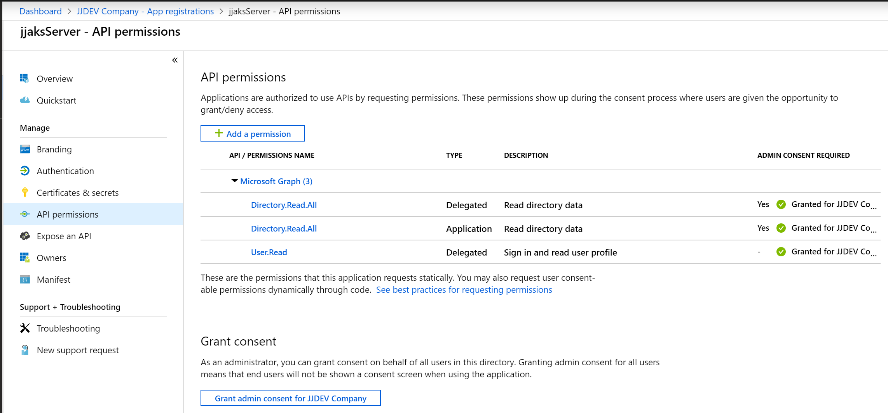
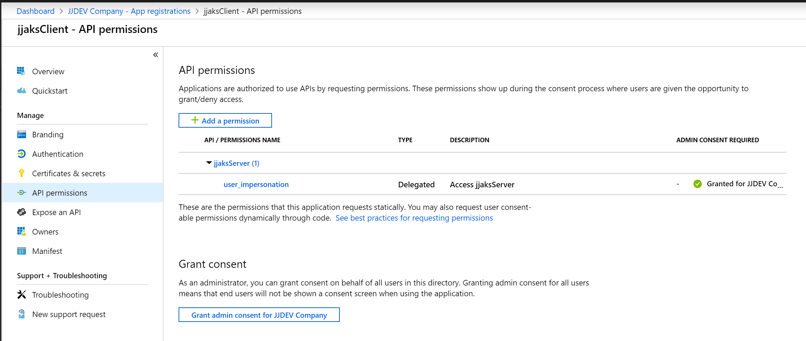
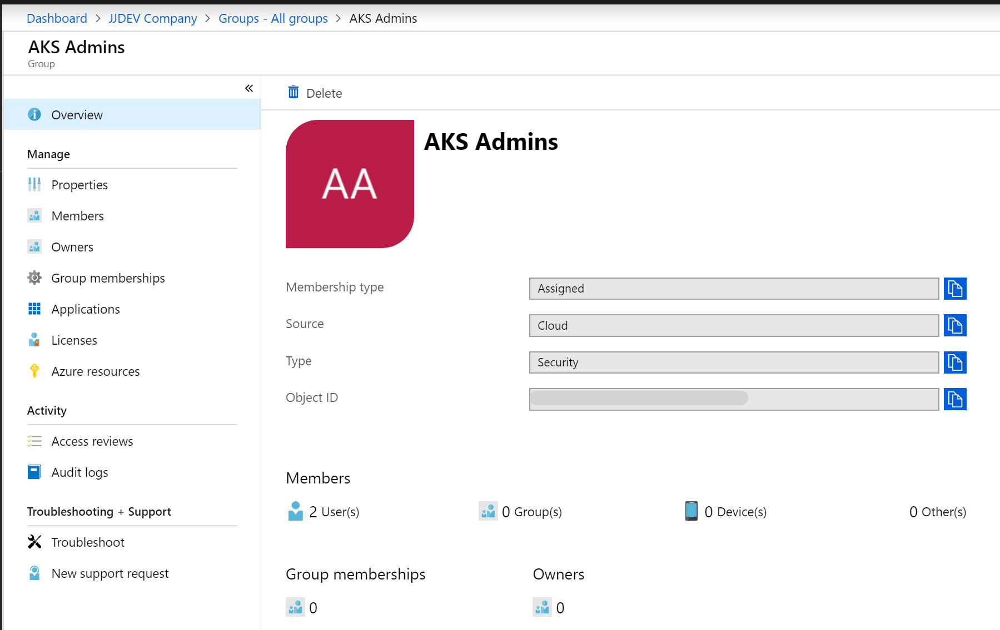

# JJ Azure .Net Core samples
Azure dotNet Core samples

## Projects

### Project WebApp dotNet Core [jjazure-web-dotnetcore](src-web/README.md)
Web project running on Docker (Linux based) in Azure Container Instances(ACI) and Azure Kubernetes Service(AKS) with Visual Studio and Visual Studio Core.

### Project WebApp dotNet Core [jjazure-web-dotnetcore-windows](src-web-windows/README.md)
Web project running on Docker (Windows based) in Azure WebApp for Containers (Visual Studio and Visual Studio Core).

### Project ApiApp dotNet Core [jjazure-webapi-dotnetcore](src-webapi/README.md)
WebApi project running on Docker (Linux based) in Azure Kubernetes Service(AKS) with Visual Studio.

## Prepare Azure Kubernetes Service(AKS) with best practices

Link to best practices https://docs.microsoft.com/en-us/azure/aks/best-practices

### Setup RBAC for AKS

Follow this instructions https://docs.microsoft.com/en-us/azure/aks/azure-ad-integration

#### Prepare Azure Active Directory

I'm using my AAD jjdev.onmicrosoft.com with this configuration:
- App Registrations jjaksServer with Enterprise Application and permissions to AAD
- App Registrations jjaksClient with Enterprise Application and permissions to jjaksServer

```bash
aksname="jjaks"
```

Run this scripts https://docs.microsoft.com/en-us/azure/aks/azure-ad-integration-cli

Use new Active Directory blade App Registrations

Create new AAD group for admins.

##### Aks Server application

```bash
echo serverApplicationId=$serverApplicationId, serverApplicationSecret=$serverApplicationSecret
```
##### Aks Client application

```bash
echo clientApplicationId=$clientApplicationId
```

For Live monitoring add additional Redirect URI https://ininprodeusuxbase.microsoft.com/* You have to use on App registration (legacy) configuration blade.


##### Create AAD group for admins


### Deploy cluster in existing Virtual Network and with RBAC

Follow this instructions https://docs.microsoft.com/en-us/azure/aks/configure-azure-cni

I have existing virtual network (created by Azure Blueprint)
- resource group vnet-central-rg
- jjvnet-central with address space 10.10.0.0/16
- dmz-aks subnet with 10.10.10.0/24

I have existing Azure Monitor Log workspace
- resource group jjdevmanagement 
- workspace name jjdev-analytics

I have existing Azure Container Registry
- resource group TEST
- name jjcontainers

#### 1. Create AKS cluster with RBAC in virtual network

```bash
az extension add --name aks-preview
az extension update --name aks-preview
```

```bash
az group create --name jjmicroservices-rg --location WestEurope

winpassword=P@ssw0rd1234
tenantId=$(az account show --query tenantId -o tsv)
vnetid=$(az network vnet subnet list --resource-group vnet-central-rg --vnet-name jjvnet-central --query [].id --output tsv | grep dmz-aks)

workspaceId=$(az resource show -n jjdev-analytics -g jjdevmanagement --resource-type microsoft.operationalinsights/workspaces --query id --output tsv)

az aks create \
    --resource-group jjmicroservices-rg \
    --name $aksname \
    --node-vm-size Standard_B2s \
    --node-count 1 \
    --min-count 1 \
    --max-count 3 \
    --enable-vmss \
    --enable-cluster-autoscaler \
    --enable-addons monitoring \
    --workspace-resource-id $workspaceId \
    --generate-ssh-keys \
    --windows-admin-username aksadmin \
    --windows-admin-password $winpassword \
    --service-principal $serverApplicationId \
    --client-secret $serverApplicationSecret \
    --aad-server-app-id $serverApplicationId \
    --aad-server-app-secret $serverApplicationSecret \
    --aad-client-app-id $clientApplicationId \
    --aad-tenant-id $tenantId \
    --network-plugin azure \
    --vnet-subnet-id $vnetid \
    --kubernetes-version 1.13.5 \
    --node-resource-group jjmicroservices-aks-rg

az aks install-cli
az aks get-credentials --resource-group jjmicroservices-rg --name $aksname --admin
az aks browse --resource-group jjmicroservices-rg --name $aksname
```

Note: To disable RBAC use --disable-rbac

#### 2. Assign admin to AKS cluster

I have AAD group with admins - AKS Admins. Update rbac-aad-admin.yaml with your AAD Group object Id.
Next login as admin (--admin) and run script.

```bash
az aks get-credentials --resource-group jjmicroservices-rg --name $aksname --admin
kubectl apply -f aks/rbac-aad-admin.yaml
```

#### 3. Try to access AKS cluster as AAD user

Try to login as AAD user to AKS cluster and get nodes.

```bash
az aks get-credentials --resource-group jjmicroservices-rg --name $aksname
kubectl get nodes
```

#### 4. Enable Dashboard for AKS with RBAC

By default Dashboard is created with minimal permissions, let's run this command to enable Dashboard for admins

```bash
kubectl create clusterrolebinding kubernetes-dashboard --clusterrole=cluster-admin --serviceaccount=kube-system:kubernetes-dashboard

az aks browse --resource-group jjmicroservices-rg --name $aksname
```

#### 5. Install Helm with RBAC enabled AKS

Create account for Helm and setup permissions
```bash
kubectl apply -f aks/helm-account.yaml
```

Install Helm Tiller with RBAC
```bash
curl https://raw.githubusercontent.com/kubernetes/helm/master/scripts/get | bash
helm init --service-account tiller
```

Problems with Tiller for Helm
- run helm init tiller --upgrade
- reinstal https://helm.sh/docs/using_helm/#deleting-or-reinstalling-tiller

#### 6. Setup permissions to Azure Container Registry

You have to setup permissions for AKS (jjaksserver) to access Azure Container Registry (jjcontainers).

```bash
ACR_NAME=jjcontainers
ACR_RESOURCE_GROUP=TEST
ACR_ID=$(az acr show --name $ACR_NAME --resource-group $ACR_RESOURCE_GROUP --query "id" --output tsv)
az role assignment create --assignee $serverApplicationId --role acrpull --scope $ACR_ID
```

Links:
- custom resource group https://docs.microsoft.com/en-us/azure/aks/faq#can-i-provide-my-own-name-for-the-aks-infrastructure-resource-group
- custom vnet https://docs.microsoft.com/en-us/azure/aks/configure-azure-cni
- connect to AAD and assign AAD admin https://docs.microsoft.com/en-us/azure/aks/azure-ad-integration-cli
- upgrade AKS pool https://docs.microsoft.com/en-us/azure/aks/use-multiple-node-pools#upgrade-a-node-pool
- enable Dashboard https://docs.microsoft.com/en-us/azure/aks/kubernetes-dashboard#for-rbac-enabled-clusters
- install Helm https://docs.microsoft.com/cs-cz/azure/aks/kubernetes-helm
- Grant access to ACR https://docs.microsoft.com/en-us/azure/container-registry/container-registry-auth-aks

### Publish services to internet

I'm using NGINX ingress controller for my demos
- external load balancer for jjwebcore
- internal load balancer for jjwebapicore

#### NGINX ingress controller
How to configure https://docs.microsoft.com/en-us/azure/aks/ingress-basic

**NGINX ingress (public load balancer)**

How to use https://docs.microsoft.com/en-us/azure/aks/ingress-basic#create-an-ingress-route

```bash
kubectl create namespace ingress-basic
helm install stable/nginx-ingress --name nginx-ingress --namespace ingress-basic --set controller.replicaCount=2 --set controller.nodeSelector."beta\.kubernetes\.io/os"=linux
```

**NGINX for Internal network (internal load balancer)** 

How to use https://docs.microsoft.com/en-us/azure/aks/ingress-internal-ip

```bash
kubectl create namespace ingress-basic-internal
helm install stable/nginx-ingress --name nginx-ingress-internal --namespace ingress-basic-internal --set controller.replicaCount=2 -f aks/internal-ingress.yaml --set controller.ingressClass=nginx-internal
```

Troubleshooting lab https://github.com/azurecz/java-k8s-workshop/blob/master/module02/README.md#install-helm-and-ingress

#### HTTP application routing (not for production)
How to configure https://docs.microsoft.com/en-us/azure/aks/http-application-routing

Enable on AKS cluster addon
```bash
az aks enable-addons --resource-group myResourceGroup --name myAKSCluster --addons http_application_routing
```

How to use https://docs.microsoft.com/en-us/azure/aks/http-application-routing#use-http-routing

#### Application Gateway Ingress controller
How to configure https://github.com/Azure/application-gateway-kubernetes-ingress

Create new Azure Identity to access AppGw https://github.com/Azure/application-gateway-kubernetes-ingress/blob/master/docs/install-existing.md#create-azure-identity-on-arm

Install AppGw ingress https://github.com/Azure/application-gateway-kubernetes-ingress/blob/master/docs/install-existing.md#install-ingress-controller-as-a-helm-chart

How to use https://github.com/Azure/application-gateway-kubernetes-ingress/blob/master/docs/tutorial.md#expose-services-over-http

### Deployment troubleshooting

Use Dashboard
```
az aks browse --resource-group jjmicroservices-rg --name $aksname
```

Use commandline
```
kubectl get deployments,services --all-namespaces
kubectl describe pod jjwebcore
kubectl describe pod jjwebapicore

kubectl describe pod nginx-ingress-controller --namespace ingress-basic
kubectl describe pod nginx-ingress-internal-controller --namespace ingress-basic-internal
```

### Connect to PaaS services like SQL server
TODO: use service endpoint to access sql server
https://docs.microsoft.com/en-us/azure/virtual-network/virtual-network-service-endpoints-overview

### Development productivity
TODO: Use DevSpaces and Remote Development with VS Code
https://docs.microsoft.com/en-us/azure/dev-spaces/

### Add Windows nodes in AKS cluster
You can combine Linux and Windows node pools
https://docs.microsoft.com/en-us/azure/aks/windows-container-cli

Required minimal cluster version is 1.14.0. Cluster must be created with windows-admin-username and windows-admin-password properties.

```bash
az aks nodepool add --resource-group jjmicroservices-rg --cluster-name jjaks --os-type Windows --name npwin --node-count 1 --kubernetes-version 1.14.0
```

Add to your manifest nodeSelector which node to use (or use taint):
      nodeSelector:
        "beta.kubernetes.io/os": windows

### Setup security
Best practices
https://docs.microsoft.com/en-us/azure/aks/operator-best-practices-network#control-traffic-flow-with-network-policies

Setup addition RBAC roles to acccess cluster
https://docs.microsoft.com/en-us/azure/aks/azure-ad-rbac

Allow communication btw services
https://docs.microsoft.com/en-us/azure/aks/use-network-policies

Policy for Kubernetes - allow only defined ACR
https://docs.microsoft.com/en-us/azure/aks/use-pod-security-policies

API whitelisting
https://docs.microsoft.com/en-us/azure/aks/api-server-authorized-ip-ranges

Limit egress traffic - use Azure Firewall
https://docs.microsoft.com/en-us/azure/aks/limit-egress-traffic

Install Istio for advanced routing and networking features
https://docs.microsoft.com/en-us/azure/aks/istio-install

Manage node security updates
https://docs.microsoft.com/en-us/azure/aks/node-updates-kured

### Setup monitoring
Enable monitoring
https://docs.microsoft.com/en-us/azure/azure-monitor/insights/container-insights-enable-existing-clusters#enable-from-azure-monitor-in-the-portal

View live logs
https://docs.microsoft.com/en-us/azure/azure-monitor/insights/container-insights-live-logs#configure-aks-with-azure-active-directory

Azure Monitor for containers
https://docs.microsoft.com/en-us/azure/azure-monitor/insights/container-insights-overview

Service Mesh application monitoring (requires Istio) for application map
https://docs.microsoft.com/en-us/azure/azure-monitor/app/kubernetes