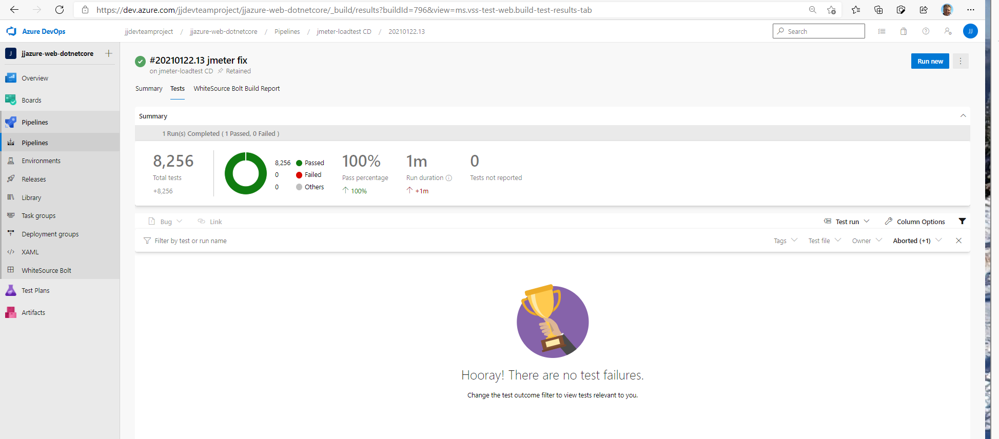

# JJ Azure web app Jmeter load tests

Used this guide https://docs.microsoft.com/en-us/samples/azure-samples/jmeter-aci-terraform/jmeter-aci-terraform/

## Building docker image

Check [Dockerfile](docker/Dockerfile) and [pipeline](azure-pipelines.docker.yml)

Import this pipeline in Azure DevOps project.

## Running load test

Check [terraform definition](terraform) and [pipeline](azure-pipelines.load-test.yml)

Import this pipeline in Azure DevOps project.

Additional artifacts are published after the test ends - JMeter Dashboard, logs and others.