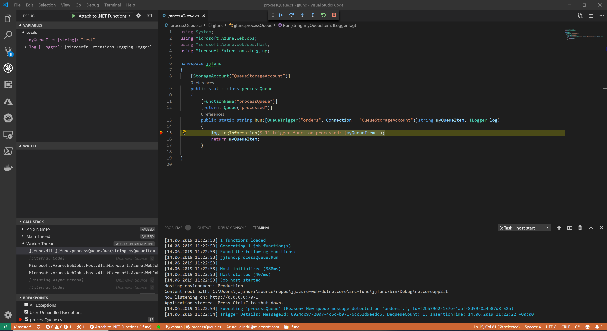

# jjazure-func
Azure Function project running in Azure Managed Kubernetes (AKS). 
This function will process messages from Azure Storage Queue - taking message from orders queue and inserting into processed queue.

https://docs.microsoft.com/en-us/azure/azure-functions/functions-create-function-linux-custom-image

## Create new Azure Function
Use commandline to create function with dockerfile

```
func init jjfunc --docker
cd jjfunc
func new
```

OR 

use Visual Studio Code https://code.visualstudio.com/tutorials/functions-extension/create-function

OR

use Visual Studio 2017/2019 https://docs.microsoft.com/en-us/azure/azure-functions/functions-create-your-first-function-visual-studio

For dotNetCore use this images
- for Linux image mcr.microsoft.com/azure-functions/dotnet:2.0
- for Windows image mcr.microsoft.com/azure-functions/dotnet:2.0-nanoserver-1809

## Debug Function locally in Visual Studio Code

Start Azure Storage Emulator - https://docs.microsoft.com/en-us/azure/storage/common/storage-use-emulator#start-and-initialize-the-storage-emulator

Open VS Code jjfunc folder and hit F5 to debug Function



## Build docker image

```
docker build jjfunc -t jjfunc
```

Try to run locally and watch process

```
docker run -it -e QueueStorageAccount='DefaultEndpointsProtocol=https;AccountName=jjfunctionastorage;AccountKey=KEY' jjfunc
```

## Push Docker image to Azure Container Repository
[Documentation how use Azure Container Repository](https://docs.microsoft.com/en-us/azure/container-registry/container-registry-get-started-docker-cli)

```bash
docker login jjcontainers.azurecr.io -u jjcontainers -p <PASSWORD>
docker tag jjfunc jjcontainers.azurecr.io/jjfunc
docker push jjcontainers.azurecr.io/jjfunc
```

## Run Function on AKS

Added Helm Chart to project

```
cd jjfunc
helm create jjfunc-charts
```

Deploy from command line

!!! Replace connection strings in values.yaml file !!!

```bash
helm install --name jjfunc jjfunc-charts --set-string image.repository=jjcontainers.azurecr.io/jjfunc --set-string image.tag=latest
kubectl describe pods jjfunc
```

## Run Function on AKS using Keda

Keda (Kubernetes Event Driven Autoscale) is project how to autoscale Function pods in Kubernetes. It contains Keda (non-http scale to zero) and Osiris (http scale to zero).

```
func kubernetes install
```