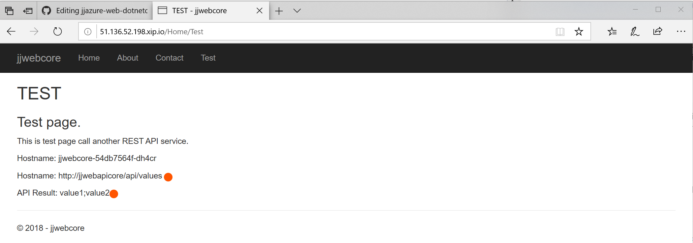
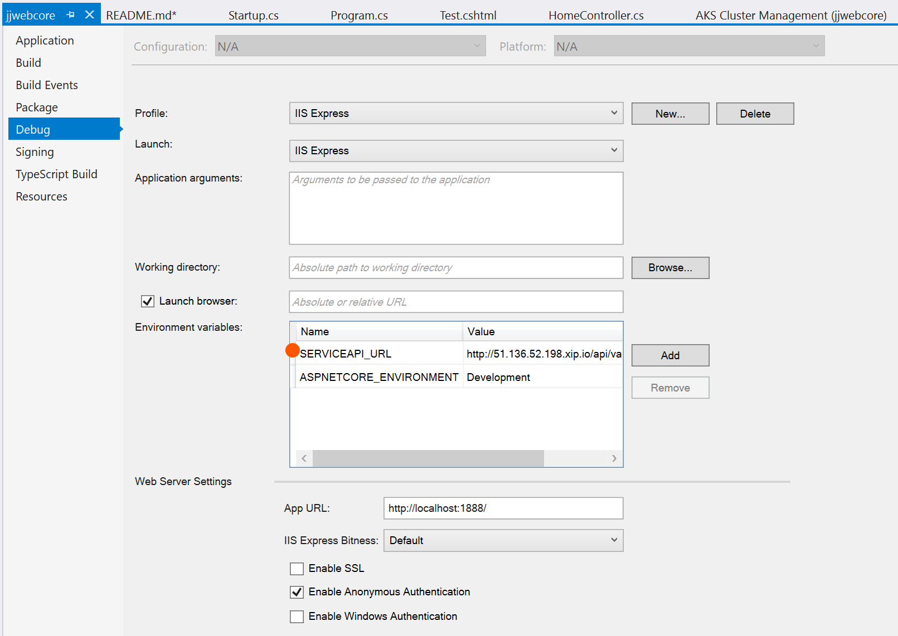

# jjazure-web-dotnetcore
Azure Web App and DotNet Core website

## Create new web site for Visual Studio Code
Use this article create new project - 
https://docs.microsoft.com/en-us/aspnet/core/tutorials/razor-pages-vsc/razor-pages-start

```
dotnet new mvc -o jjwebcore
```

## Build and deploy web site
You can open project in Visual Studio Code or Visual Studio 2017. 
Visual Studio 2017 - project has Docker support files - Dockerbuild and Compose.

### Visual Studio 2017
Simply select Publish from context menu. Two options:
1. Select Azure Web App
2. Select Azure Container Registry

### Visual Studio Code
#### Docker for non-root user
Add user into docker group - [link](https://docs.docker.com/engine/installation/linux/linux-postinstall/#manage-docker-as-a-non-root-user)
```bash
sudo usermod -aG docker $USER
```

#### Publish DotNet project
```bash
dotnet publish jjwebcore.csproj -c Release -o ./obj/Docker/publish
```

#### Build Docker project
[Documentation how to compile docker project](https://docs.microsoft.com/en-us/dotnet/core/docker/building-net-docker-images)
```bash
cd jjwebcore
docker build -t jjwebcore .
```
or build with Docker Compose
```bash
docker-compose build
```

#### Run project
Visual Studio Code - select Debug menu and Start with/without debugging

or start manually
```bash
docker run -d -p 80:80 jjwebcore
```

### Push Docker image to Azure Container Repository
[Documentation how use Azure Container Repository](https://docs.microsoft.com/en-us/azure/container-registry/container-registry-get-started-docker-cli)

```bash
docker login jjcontainers.azurecr.io -u jjcontainers -p <PASSWORD>
docker tag jjwebcore jjcontainers.azurecr.io/jjwebcore
docker push jjcontainers.azurecr.io/jjwebcore
```
### Run Docker image in Azure Container Instance
```bash
az container create -g TEST --name jjwebcore --image jjcontainers.azurecr.io/jjwebcore --registry-password <PASSWORD> --ip-address public --ports 80
az container show -g TEST -n jjwebcore
```

Open browser with IP listed above, e.g. http://52.233.194.71

## Run web on AKS and call service running on AKS

Added Helm Chart with Visual Studio into this web project - followed instructions from [jjwebapicore project](../src-webapi/readme.md) .

Added reference to service: http://jjwebapicore/api/values (referencing AKS service)

Test page is calling REST API jjwebapicore service and printing result.


Local debugging is using reference to service from environment variables defined in Visual Studio project
