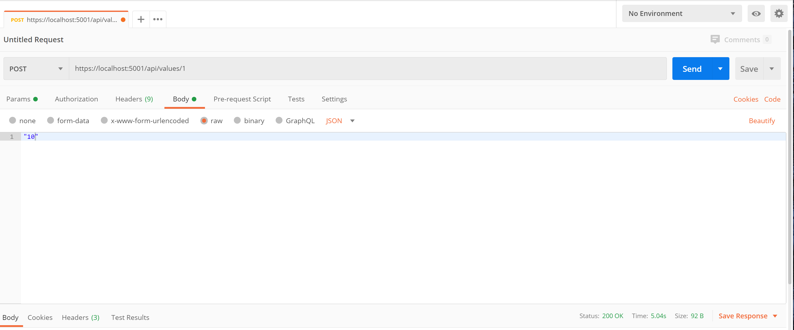

# jjazure-webapi-dotnetcore-dapr
.Net Core API web app running on Dapr

- [Dapr](https://github.com/dapr/docs/tree/master/overview) is a portable, event-driven, serverless runtime for building distributed applications across cloud and edge
- Dapr SDK for .Net https://github.com/dapr/dotnet-sdk

We will work from Visual Studio Code, there is [Dapr extension](https://marketplace.visualstudio.com/items?itemName=ms-azuretools.vscode-dapr) available.

## Dapr installation

Install Dapr cli and run locally

```ps
powershell -Command "iwr -useb https://raw.githubusercontent.com/dapr/cli/master/install/install.ps1 | iex"
dapr init
```

### Use Dapr SDK

Modify services.AddControllers().AddDapr();

Next modify service to use Dapr sidecar.

### Run locally
 
```ps
cd .\jjwebapicoredapr\
dapr run --app-id jjwebapicoredapr --app-port 5000 dotnet run
```

Try to post value


Try access http://localhost:5000/api/values/1 to get value

### Debug in Visual Studio Code

Check this [Extension](https://marketplace.visualstudio.com/items?itemName=ms-azuretools.vscode-dapr) and scaffold Dapr task.

### Debug in Visual Studio 2019

Not supported now.