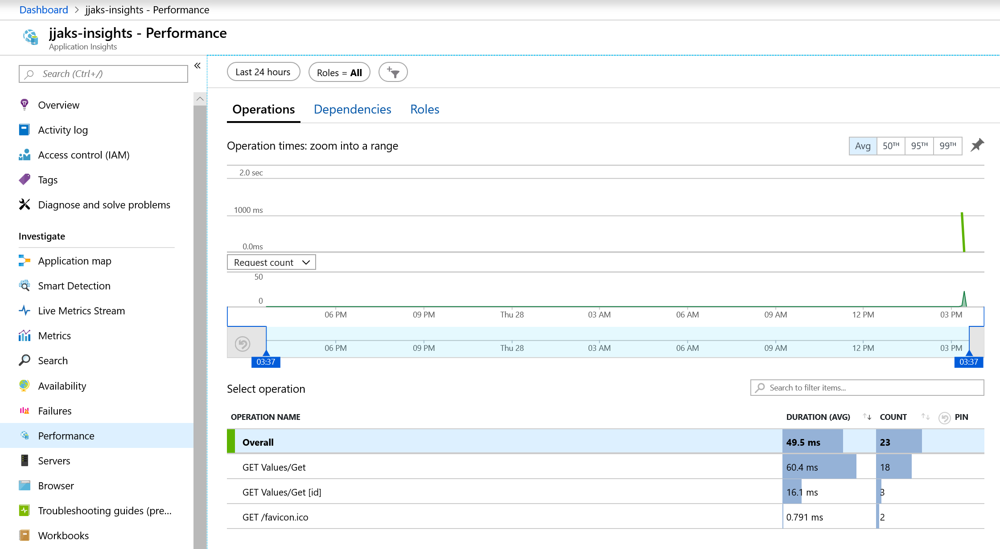
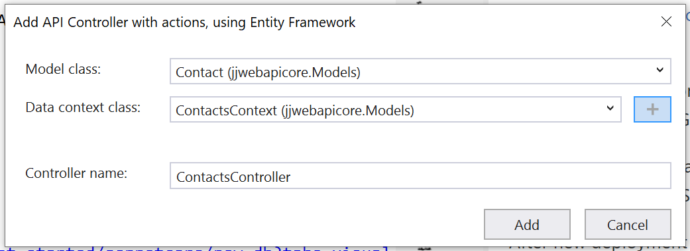
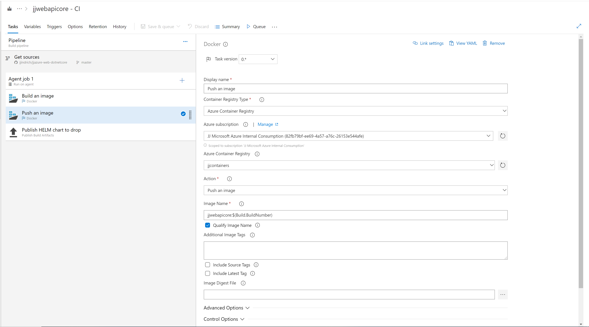
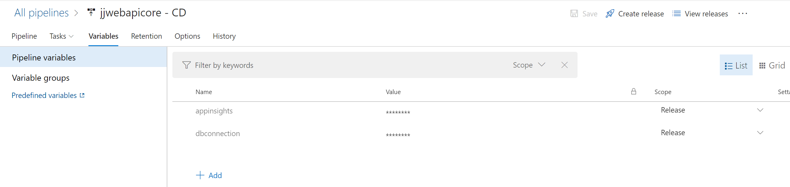
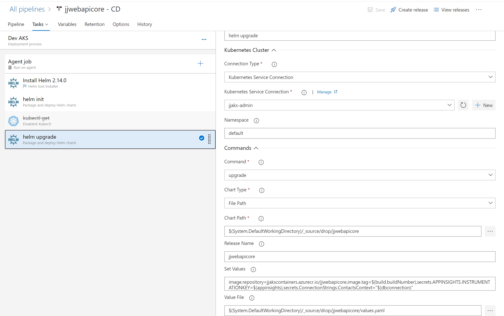
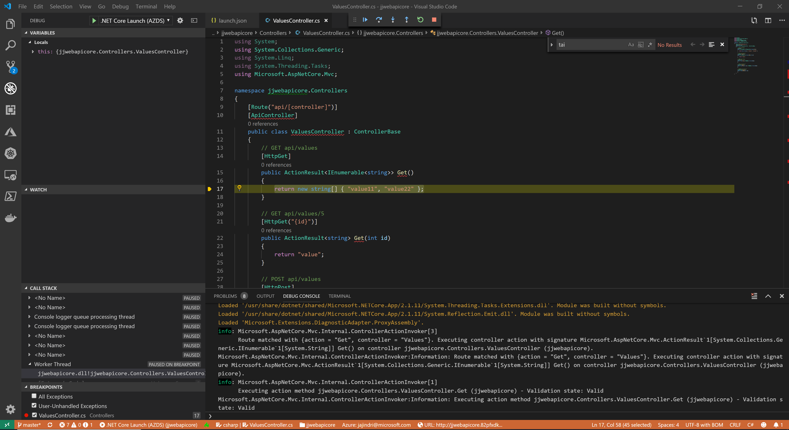
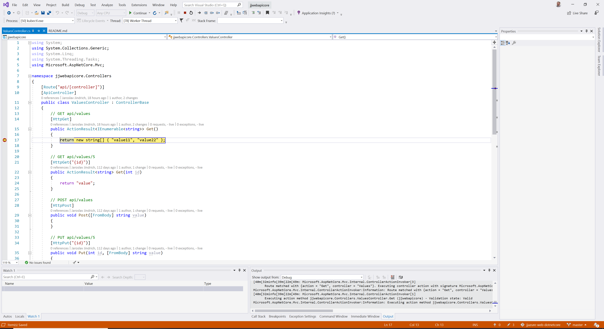

# jjazure-webapi-dotnetcore
.Net Core API web app running on Azure AKS using Visual Studio 2017

- Using Linux image because of Kubernetes
- Using Visual Studio Tools to avoid Kubernetes hell

## Add Kubernetes manifests

Added Kubernetes support from Visual Studio 2017, docker file and helm chart is generated automatically.

Using Visual Studio tools:
- Visual Studio Kubernetes Tools - https://docs.microsoft.com/en-us/visualstudio/containers/tutorial-kubernetes-tools?view=vs-2017
- AKS Publishing Tools - https://aka.ms/get-vsk8spublish

## Deploy to Kubernetes

Visual Studio 2017 -> Click on Solution folder and select **Publish to Azure AKS**. There is created .akspub publishing profile.


or use command line

```
helm install --name jjwebapicore jjwebapicore/charts/jjwebapicore --set-string image.repository=jjcontainers.azurecr.io/jjwebapicore --set-string image.tag=2019051809
```

How to validate final template ?
```
helm template
```

Now check public IP address for our service http://your_ip/api/values

```
kubectl get svc --all-namespaces
```

## Add Application Insights telemetry

Follow this instructions to add Application insights - https://github.com/Microsoft/ApplicationInsights-aspnetcore/wiki/Getting-Started-with-Application-Insights-for-ASP.NET-Core#option-2-environment-variable

- change application code to use Application Insights (using environment variable APPINSIGHTS_INSTRUMENTATIONKEY)

- added secret to values.yaml key and value of APPINSIGHTS_INSTRUMENTATIONKEY.

After new deployment you will get this report - e.g. Performance



## Add Entity Framework for SQL server connection

Follow this instructions to add EF Core https://docs.microsoft.com/en-us/ef/core/get-started/aspnetcore/new-db?tabs=visual-studio

OR

Use Visual Studio 2019 to add New scaffolder Item API controller



Next create InitialCreate script and create database https://docs.microsoft.com/en-us/ef/core/get-started/aspnetcore/new-db?tabs=visual-studio#create-the-database

### Use AKS Pod Identity to authenticate to Azure SQL

Enable on AKS cluster Pod Identity https://docs.microsoft.com/en-us/azure/aks/operator-best-practices-identity#use-pod-identities

Change code to setup SQL connection https://docs.microsoft.com/en-us/azure/active-directory/managed-identities-azure-resources/tutorial-windows-vm-access-sql#get-an-access-token-using-the-vms-system-assigned-managed-identity-and-use-it-to-call-azure-sql

## Configure DevOps

https://docs.microsoft.com/en-us/azure/devops/pipelines/tasks/deploy/helm-deploy?view=azure-devops#install-command

Configure Azure Pipeline https://docs.microsoft.com/en-us/azure/devops/pipelines/repos/github?view=azure-devops&tabs=yaml

[](https://dev.azure.com/jjdevteamproject/jjazure-web-dotnetcore/_build/latest?definitionId=33)


### Build pipeline


```yaml
pool:
  name: Hosted Ubuntu 1604
steps:
- task: Docker@0
  displayName: 'Build an image'
  inputs:
    azureSubscription: 'subscription'
    azureContainerRegistry: '{"loginServer":"jjcontainers.azurecr.io", "id" : "/subscriptions/XXXXXXXXXXXXXXXXXX/resourceGroups/TEST/providers/Microsoft.ContainerRegistry/registries/jjcontainers"}'
    dockerFile: 'src-webapi/jjwebapicore/Dockerfile'
    defaultContext: False
    context: 'src-webapi'
    imageName: 'jjwebapicore:$(Build.BuildNumber)'

- task: Docker@0
  displayName: 'Push an image'
  inputs:
    azureSubscription: 'subscription'
    azureContainerRegistry: '{"loginServer":"jjcontainers.azurecr.io", "id" : "/subscriptions/XXXXXXXXXXXXXXXXXX/resourceGroups/TEST/providers/Microsoft.ContainerRegistry/registries/jjcontainers"}'
    action: 'Push an image'
    imageName: 'jjwebapicore:$(Build.BuildNumber)'

- task: PublishBuildArtifacts@1
  displayName: 'Publish HELM chart to drop'
  inputs:
    PathtoPublish: 'src-webapi/jjwebapicore/charts'
```

### Release pipeline

**Authentication to AKS**
Use Kubernetes Service Connection type Kubeconfig. The reason is RBAC enabled cluster. Is not supported to authenticate to AAD. You have to use admin account.

How to get kubeconfig

```
az aks get-credentials -n $aksname -g jjmicroservices-rg --admin
cat ~/.kube/config
```

Create variables in pipeline

- Application Insights
- SQL Connection string - you have to escape comma in connection string to \, e.g. Server=tcp:jjaks-sql.database.windows.net\,1433;Initial...



Create pipeline tasks with Ubuntu agent

- install helm
- helm init
- helm upgrade



```yaml
#Your build pipeline references a secret variable named ‘appinsights’. Create or edit the build pipeline for this YAML file, define the variable on the Variables tab, and then select the option to make it secret. See https://go.microsoft.com/fwlink/?linkid=865972
#Your build pipeline references a secret variable named ‘dbconnection’. Create or edit the build pipeline for this YAML file, define the variable on the Variables tab, and then select the option to make it secret. See https://go.microsoft.com/fwlink/?linkid=865972

steps:
- task: HelmDeploy@0
  displayName: 'helm upgrade'
  inputs:
    connectionType: 'Kubernetes Service Connection'
    kubernetesServiceConnection: 'jjaks-admin'
    namespace: default
    command: upgrade
    chartType: FilePath
    chartPath: '$(System.DefaultWorkingDirectory)/_source/drop/jjwebapicore'
    releaseName: jjwebapicore
    overrideValues: 'image.repository=jjakscontainers.azurecr.io/jjwebapicore,image.tag=$(build.buildNumber),secrets.APPINSIGHTS.INSTRUMENTATIONKEY=$(appinsights),secrets.ConnectionStrings.ContactsContext="$(dbconnection)"'
    valueFile: '$(System.DefaultWorkingDirectory)/_source/drop/jjwebapicore/values.yaml'
    waitForExecution: false
```

## Development on AKS with Azure Dev Spaces

Check Azure Dev Spaces are installed on your cluster correctly.

```
azds show-context
azds space list
```

### Azure Dev Spaces with Visual Studio Code

Azure Dev Spaces allows you to develop and debug your application in context of Kubernetes cluster, meaning to be able access other services running in cluster.

To run application, open folder jjwebapicode in Visual Studio Code and just hit F5 to debug.

You will get url running your application in AKS in azds space, like http://jjwebapicore.82pfxdkqm6.weu.azds.io/api/values



### Azure Dev Spaces with Visual Studio 2019

To run application, open solution jjwebapicode in Visual Studio with profile Azure Dev Spaces and just hit F5 to debug.

You will get url running your application in AKS in azds space, like http://jjwebapicore.82pfxdkqm6.weu.azds.io/api/values

