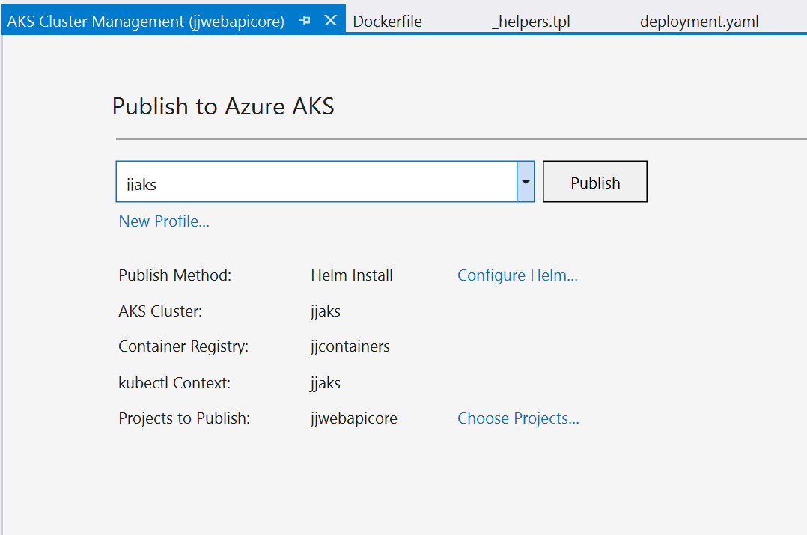

# jjazure-webapi-dotnetcore
.Net Core API web app running on Azure AKS using Visual Studio

- Using Linux image because of Kubernetes
- Using Visual Studio Tools to avouid Kubernetes hell

## Add Kubernetes manifests

Added Kubernetes support from Visual Studio 2017, docker file and helm chart is generated automatically.

Using Visual Studio tools:
- Visual Studio Kubernetes Tools - https://docs.microsoft.com/en-us/visualstudio/containers/tutorial-kubernetes-tools?view=vs-2017
- AKS Publishing Tools - https://aka.ms/get-vsk8spublish

***TODO*** Change YAML to publish API to internet

## Deploy to Kubernetes

Click on Solution folder and select Publish to Azure AKS. There is created .akspub publishing profile.

## Add Application Insights telemetry
**TODO** add Application Insights and see telemetry

## Add reference to another API service running on cluster
**TODO** two different API services calling each other - reference in manifest
