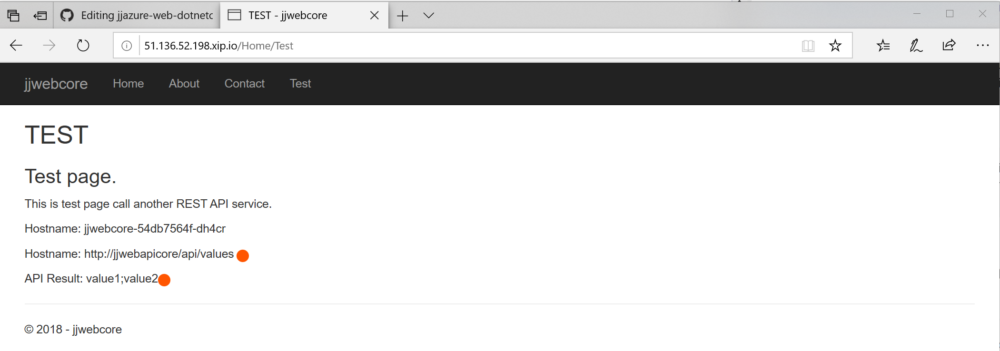
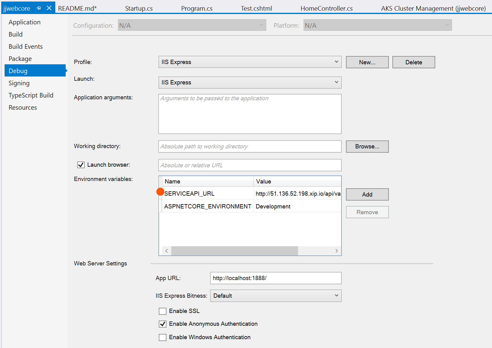
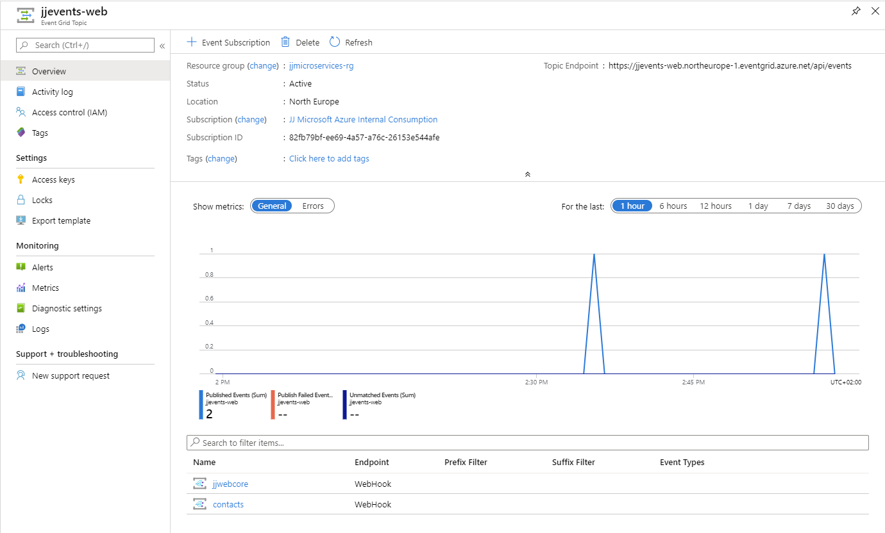
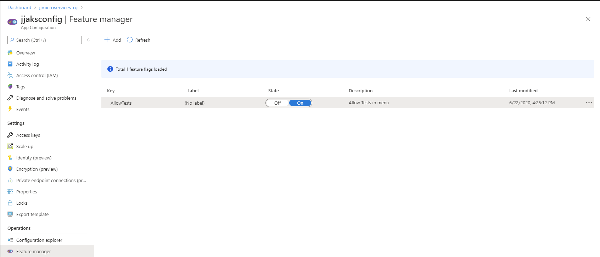

# jjazure-web-dotnetcore
Azure Web App and DotNet Core website (dotnet 6.0)

## Create new web site for Visual Studio Code
Use this article create new project - 
https://docs.microsoft.com/en-us/aspnet/core/tutorials/razor-pages-vsc/razor-pages-start

```
dotnet new mvc -o jjwebcore
```

## Build and deploy web site
You can open project in Visual Studio Code or Visual Studio 2017. 
Visual Studio 2017 - project has Docker support files - Dockerbuild and Compose.

### Visual Studio 2017
Simply select Publish from context menu. Two options:
1. Select Azure Web App
2. Select Azure Container Registry

### Visual Studio Code
#### Docker for non-root user
Add user into docker group - [link](https://docs.docker.com/engine/installation/linux/linux-postinstall/#manage-docker-as-a-non-root-user)
```bash
sudo usermod -aG docker $USER
```

#### Publish DotNet project
```bash
dotnet publish jjwebcore.csproj -c Release -o ./obj/Docker/publish
```

#### Build Docker project
[Documentation how to compile docker project](https://docs.microsoft.com/en-us/dotnet/core/docker/building-net-docker-images)
```bash
cd jjwebcore
docker build -t jjwebcore .
```
or build with Docker Compose
```bash
docker-compose build
```

#### Run project
Visual Studio Code - select Debug menu and Start with/without debugging

or start manually
```bash
docker run -d -p 80:80 jjwebcore
```

### Push Docker image to Azure Container Repository
[Documentation how use Azure Container Repository](https://docs.microsoft.com/en-us/azure/container-registry/container-registry-get-started-docker-cli)

```bash
docker login jjcontainers.azurecr.io -u jjcontainers -p <PASSWORD>
docker tag jjwebcore jjcontainers.azurecr.io/jjwebcore
docker push jjcontainers.azurecr.io/jjwebcore
```
### Run Docker image in Azure Container Instance
```bash
az container create -g TEST --name jjwebcore --image jjcontainers.azurecr.io/jjwebcore --registry-password <PASSWORD> --ip-address public --ports 80
az container show -g TEST -n jjwebcore
```

Open browser with IP listed above, e.g. http://52.233.194.71

## Run web on AKS and call service running on AKS

Added Helm Chart with Visual Studio into this web project - followed instructions from [jjwebapicore project](../src-webapi/readme.md) .

Added reference to service: http://jjwebapicore/api/values (referencing AKS service)

Deploy from command line
```bash
helm install jjwebcore jjwebcore/charts/jjwebcore --set-string image.repository=jjcontainers.azurecr.io/jjwebcore --set-string image.tag=2019060323
```

Now check public IP address for our web http://your_ip

Note: If you want to run on specific dns name, just fill host like your_ip.xip.io and than access http://your_ip.xip.io

Test page is calling REST API jjwebapicore service and printing result.


Local debugging is using reference to service from environment variables defined in Visual Studio project


## Integrate with Azure EventGrid topic

Azure EventGrid Topic is event messaging service. It can consume source data (pushed by source) and push it as REST to some destionation.
Our destination will be api /webhook on jjwebcore website.

How to create WebHook receiver

- https://docs.microsoft.com/en-us/azure/event-grid/security-authentication
- https://docs.microsoft.com/en-us/azure/event-grid/receive-events
- https://galdin.dev/blog/creating-an-azure-eventgrid-webhook-in-asp-net-core/

*Warning: Selfsigned certifite cannot be used.*

Configure Azure EventGrid

- create EventGrid Topic, like jjevents-web
- create subscription with Endpoint Type WebHook and type url https://your_ip/api/webhook

Because cannot be used untrusted certificate, deploy Azure Front Door or valid certificate on AKS cluster.

My test endpoint without any processing logic is https://jjaks.jjdev.org/api/webhook

Testing my contacts Azure EventGrid WebHook to create contact

- create webhook subscription to https://jjaks.jjdev.org/contacts/CreateWebhook
- send message to Event Grid with random ContactId

Sample Azure EventGrid message to create contract
```json
[{
  "id": "2d1781af-3a4c-4d7c-bd0c-e34b19da4e66",
  "topic": "/subscriptions/xxxxxxxx-xxxx-xxxx-xxxx-xxxxxxxxxxxx",
  "subject": "jjwebcore/contracts",
  "data": {
    "contactId": "100",
    "fullName" : "auto generated"
  },
  "eventType": "JJ.createContract",
  "eventTime": "2018-01-25T22:12:19.4556811Z",
  "metadataVersion": "1",
  "dataVersion": "1"
}]
```

```bash
endpoint=$(az eventgrid topic show --name jjevents-web -g jjmicroservices-rg --query "endpoint" --output tsv)
key=$(az eventgrid topic key list --name jjevents-web -g jjmicroservices-rg --query "key1" --output tsv)
event='[ {"id": "'"$RANDOM"'", "eventType": "JJ.createContract", "subject": "jjwebcore/contracts", "eventTime": "'`date +%Y-%m-%dT%H:%M:%S%z`'", "data":{ "contactId": "'"$RANDOM"'", "fullName": "Auto generated"},"dataVersion": "1.0"} ]'
curl -X POST -H "aeg-sas-key: $key" -d "$event" $endpoint
```



## Manage FeatureFlags with Azure App Configuration service

This implementation will show how to enable/disable Test in menu. Settings is managed by [App Configuration service](https://docs.microsoft.com/en-us/azure/azure-app-configuration/overview)



1. Create new App Configuration service jjaksconfig
2. Create new Feature "AllowTests" and set Off
3. Add code to use FeatureManagement - https://github.com/microsoft/FeatureManagement-Dotnet
   - download nuget packages
   - change StartUp.cs and Program.cs to load App Configuration service - using ConnectionStrings:AppConfig
   - change controller and menu file to work with FeatureFlag
   - change Kubernetes values file - using ConnectionStrings__AppConfig (__ because of structure)
4. Try to set feature On -> Off -> On (it takes cca 1min for refresh)

## Integrate Azure B2C

Doc
- register app https://learn.microsoft.com/en-us/azure/active-directory-b2c/tutorial-register-applications#register-a-web-application
- c# integrate https://learn.microsoft.com/en-us/aspnet/core/security/authentication/azure-ad-b2c?view=aspnetcore-7.0

Steps to configure
- create Azure B2C tenant - jjazureb2c
- create application - redirect uri https://localhost:57590/signin-oidc and tokens
- update appsettings.json - update client id and secret
